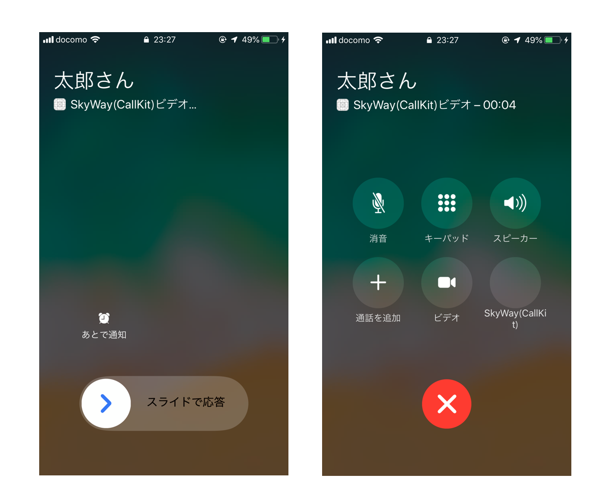
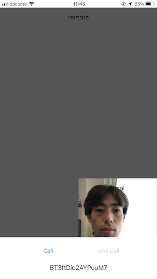
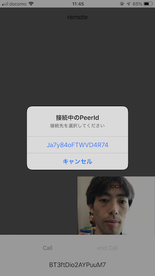
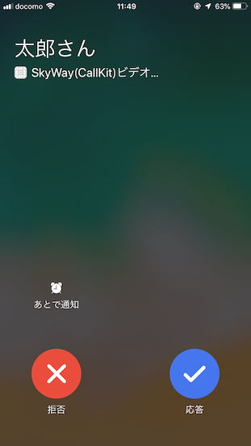
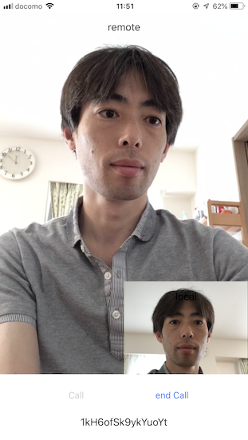

# SkyWay CallKit Sampler

SkyWay と CallKit を使ったアプリのサンプルコードです。



# 対応OS

iOS 10+

# ビルド手順

## CocoaPods

チェックアウトしたディレクトリで以下のコマンドを実行

```bash
$ pod install
```

## API KEY

skyway-callkit-sampler.xcworkspace を開いて AppDelegate.swift に SkyWay の API KEY と Domain をセットします

```swift
-    var skywayAPIKey:String?
-    var skywayDomain:String?
+    let skywayAPIKey = "xxxxxxxx-xxxx-xxxx-xxxx-xxxxxxxxxxxx"
+    let skywayDomain = "localhost"
```

APIキーは `listAllPeers APIを利用する` にチェックを入れてください

## AppID、Provisioning Profile

TARGETS から skyway-callkit-sampler を選んで Signing（署名）を設定します

## Build

実機を選んでビルド（CallKitはSimulatorに対応していません）

# 使い方

- ２台の端末でアプリを起動します



- [call] ボタンを押して接続先の PeerID を選択



- 選択した PeerID の端末に着信画面が表示されます



- 応答するとビデオ通話が開始



- [end Call] を押して終了

